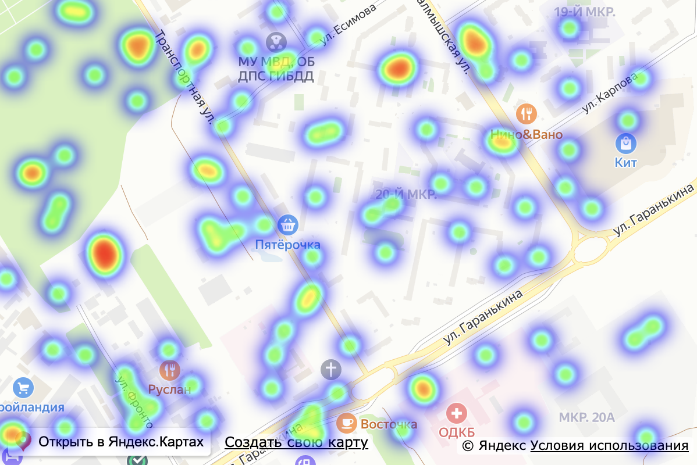

# Тепловая карта

Пример генерирования тепловой карты из гео-координат. В данный момент расположение точек генерируется случайным образом, но можно подставить настоящие данные чтобы получить реалистичную картину.



## Запуск

В Терминале перейдите в папку, куда хотите загрузить код примера:
```
cd /Users/andrewkozinsky/Desktop
```

Скачайте код (требуется установленный клиент Гита):
```
git clone git@github.com:AndrewKozinsky/heat-map.git
```

Перейдите в папку проекта:
```
cd heat-map
```

Установите зависимости:
```
npm i
```

Запустите проект:
```
npm run dev
```

В Терминале будет указан адрес открытого проекта в браузере (обычно http://localhost:5173).